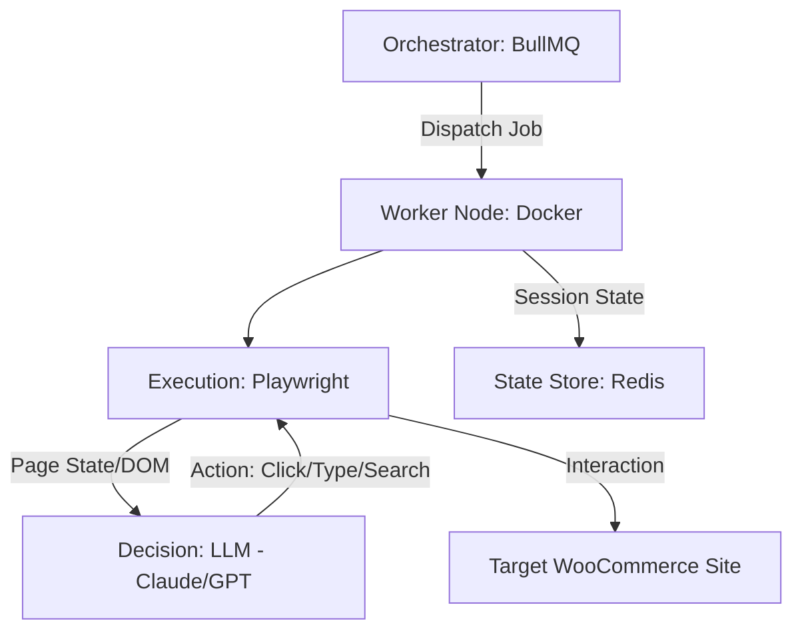

# 🤖 AgenticTraffic: AI-Driven WooCommerce Simulation

[](https://opensource.org/licenses/MIT)
[](https://nodejs.org/)
[](https://playwright.dev/)

**AgenticTraffic** is a sophisticated load-testing framework that goes beyond traditional HTTP request simulation. It leverages Large Language Models (LLMs) to power autonomous agents that interact with WooCommerce stores as real humans would—navigating the DOM, making decisions based on page content, and following non-linear user journeys.

## 🚀 Why Agentic Traffic?

Traditional load tools (like JMeter or K6) send repetitive, predictable requests. **AgenticTraffic** provides:
- **True Realism:** Agents "read" the page and react to dynamic content.
- **Unpredictable Paths:** Simulation of "window shopping" and indecisive behavior.
- **Deep Server Stress:** Triggers complex server-side logic (cart updates, session handling, auth) that simple requests often bypass.
- **Autonomous Execution:** Define a persona, and the AI handles the interaction loop.

---

## 🏗 Architecture

The system decouples the **Brain** from the **Hands**:



### Core Components:
- **Execution Engine (Playwright):** High-performance browser automation for interacting with the web UI.
- **Decision Engine (LLM):** Uses state-of-the-art models (Claude 3.5 Sonnet / GPT-4o) to interpret the current view and determine the next logical action.
- **Orchestrator (BullMQ & Redis):** Manages agent concurrency, distributes tasks across workers, and maintains session persistence.

---

## 🎭 Simulation Personas

Agents are assigned personas to ensure a balanced distribution of server load:

| Persona | Goal | Behavior | Primary Stress Point |
| :--- | :--- | :--- | :--- |
| **Decisive Buyer** | Quick Conversion | Search $\rightarrow$ Product $\rightarrow$ Checkout | Database Writes (Orders) |
| **Comparison Shopper** | Market Research | Category $\rightarrow$ Multiple Product Pages $\rightarrow$ Exit | Page Reads & Cache |
| **Indecisive User** | Cart Manipulation | Add $\rightarrow$ Remove $\rightarrow$ Change Variant $\rightarrow$ Checkout | Session & Cart Management |
| **Account Manager** | Profile Maintenance | Login $\rightarrow$ Address Edit $\rightarrow$ Order History | Auth & User Tables |

---

## 🛠 Getting Started

### Prerequisites
- **Node.js** $\ge$ 18.0.0
- **Redis** (Running locally or via Docker)
- **LLM API Key** (Anthropic or OpenAI)

### Installation
1. Clone the repository:
   ```bash
   git clone https://github.com/selvaggiesteban/Agentic_Traffic.git
   cd Agentic_Traffic
   ```
2. Install dependencies:
   ```bash
   npm install
   npx playwright install chromium
   ```

### Configuration
Create a `.env` file in the root directory:
```env
ANTHROPIC_API_KEY=your_api_key_here
# OR
OPENAI_API_KEY=your_api_key_here

REDIS_HOST=127.0.0.1
REDIS_PORT=6379

TARGET_SITE_URL=https://your-woocommerce-site.com
```

### Running the Simulation
Start the orchestrator:
```bash
npm start
```

---

## 📈 Performance Monitoring

To get the most out of AgenticTraffic, we recommend monitoring the following KPIs on your server:
- **TTFB (Time to First Byte):** To detect server-side processing delays.
- **Order Throughput:** Measuring the max orders/min before 5xx errors appear.
- **Database CPU/RAM:** Identifying slow queries during peak agent activity.
- **Error Rate:** Monitoring the ratio of successful vs. failed agent journeys.

## 🛡 Safety & Ethics
This tool is designed for **performance testing on environments you own or have explicit permission to test**. 
- **Circuit Breaker:** The orchestrator includes a safety mechanism to kill agents if server error rates spike.
- **Think Time:** Agents include randomized delays to avoid being flagged as simple DDoS attacks.

## 📜 License
Distributed under the MIT License. See `LICENSE` for more information.
